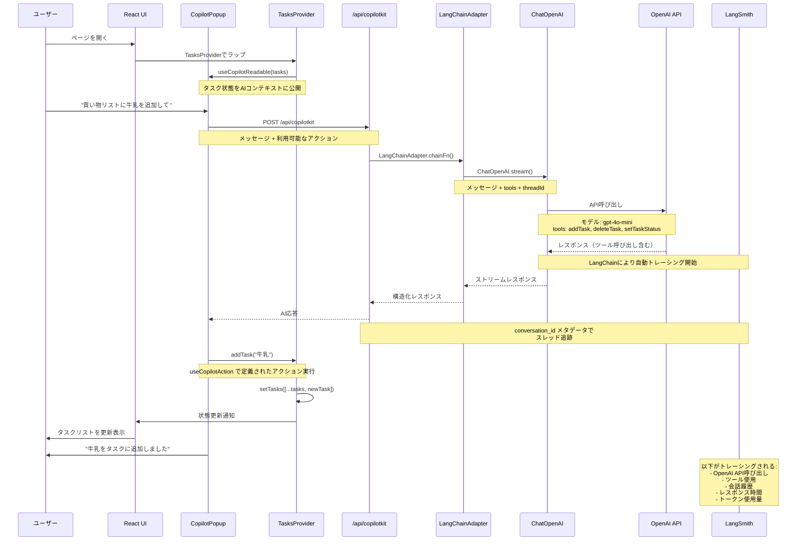
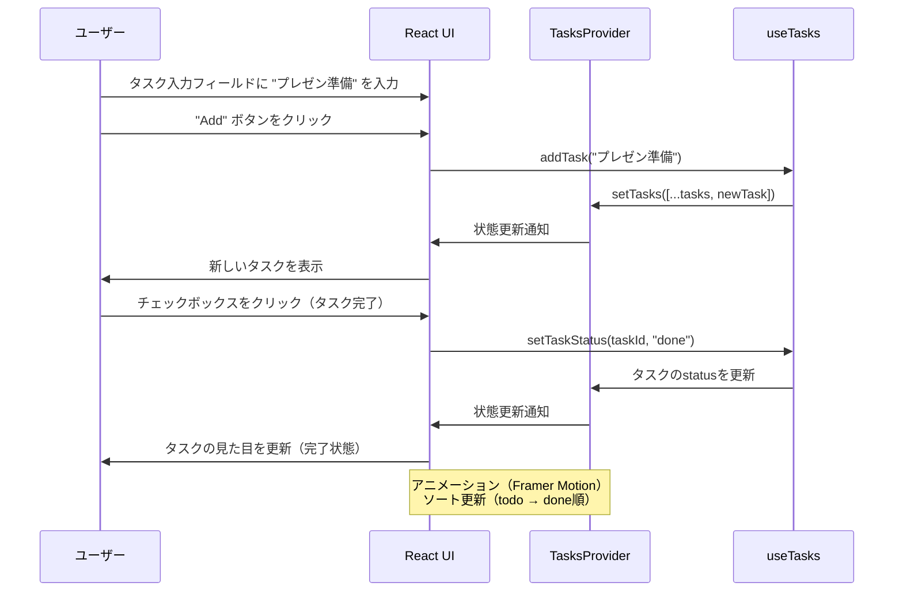
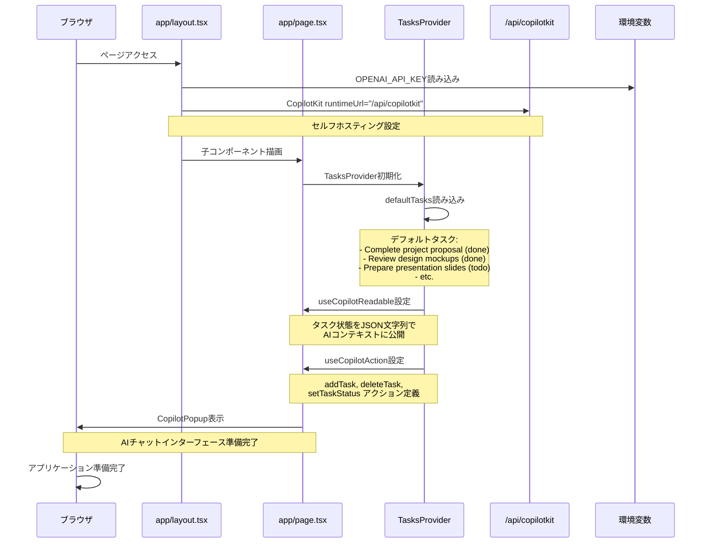
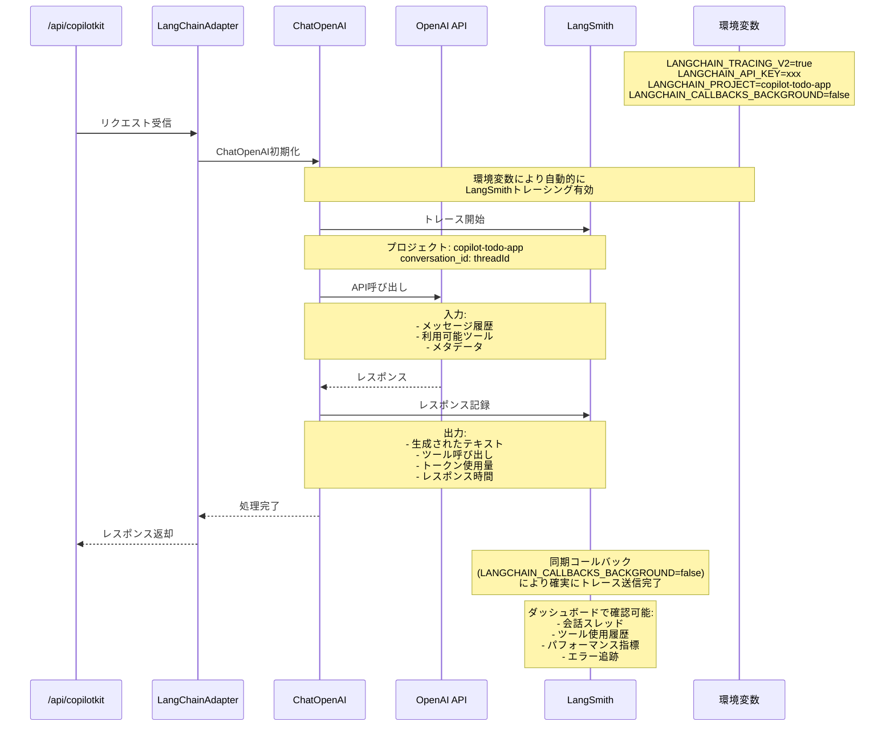

# アーキテクチャフロー

このドキュメントでは、AI-Powered Todo Appの処理の流れをMermaidシーケンス図で説明します。

## AI操作のフロー

ユーザーがAIチャットでタスク操作を行う際の完全なフローを示します。

## 通常のタスク操作フロー

ユーザーが直接UIでタスクを操作する場合のフローです。

## 初期化フロー

アプリケーションの起動時の処理フローです。

## LangSmith トレーシングフロー

LangSmithでの観測性とトレーシングの詳細フローです。

