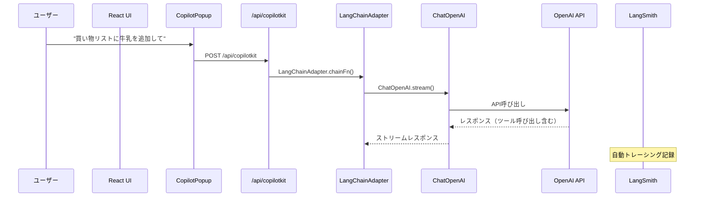

# CopilotKitでAI-Powered Todoアプリを構築：OpenAI API統合とLangSmithトレーシングの実装

## はじめに

近年、フロントエンド開発においてAI機能の統合が注目を集めており、ユーザーが自然言語でアプリケーションを操作できるインターフェースの需要が高まっています。本記事では、CopilotKitというライブラリを使用して、チャットベースでタスク操作が可能なTodoアプリケーションを構築した過程をご紹介いたします。

特に、公式チュートリアルから一歩進んで、OpenAI APIの直接統合とLangSmithによる観測性の実装を行った際の技術的課題と解決策について詳しく解説いたします。また、開発にはClaude Code（MCPを活用したAI開発アシスタント）を活用し、効率的なコーディング体験を得ることができました。

最終的に構築したアプリケーションでは、「買い物リストに牛乳を追加して」「完了したタスクをすべて削除して」といった自然言語でのタスク操作が可能となり、すべてのAI操作がLangSmithで詳細にトレーシングされる構成を実現しました。

## 構築したアプリケーションの概要

今回構築したのは、以下の技術スタックを使用したTodoアプリケーションです：

- **Framework**: Next.js 14 (App Router)
- **Language**: TypeScript  
- **AI統合**: CopilotKit + OpenAI API + LangSmith
- **UI**: Tailwind CSS + shadcn/ui + Framer Motion
- **状態管理**: React Context

主な機能として、従来のクリック操作に加えて、AIチャットによる自然言語でのタスク管理、OpenAI APIの直接使用によるベンダーロックインの回避、そしてLangSmithによる詳細な観測性を実現しています。

## ステップ1: CopilotKitチュートリアルの実装

開発のスタートとして、[CopilotKit公式チュートリアル](https://docs.copilotkit.ai/tutorials/ai-todo-app/overview)に従って基本的なTodoアプリケーションを構築しました。CopilotKitは、React アプリケーションにAI機能を簡単に統合できるライブラリです。

### CopilotKitの基本セットアップ

まず、アプリケーション全体をCopilotKitプロバイダーでラップします：

```tsx
// app/layout.tsx
import { CopilotKit } from "@copilotkit/react-core";

export default function RootLayout({ children }: { children: ReactNode }) {
  return (
    <html lang="en">
      <body>
        <CopilotKit publicApiKey={process.env.NEXT_PUBLIC_COPILOTKIT_API_KEY}>
          {children}
        </CopilotKit>
      </body>
    </html>
  );
}
```

次に、AIチャットインターフェースを提供するCopilotPopupコンポーネントを配置します：

```tsx
// app/page.tsx
import { CopilotPopup } from "@copilotkit/react-ui";
import "@copilotkit/react-ui/styles.css";

export default function Home() {
  return (
    <>
      <TasksProvider>
        <TasksList />
      </TasksProvider>
      <CopilotPopup />
    </>
  );
}
```

### AIアクションの実装

CopilotKitの核となるのは、`useCopilotAction`と`useCopilotReadable`フックです。これらを使用してAIがアプリケーションの状態を読み取り、操作できるようにします：

```tsx
// lib/hooks/use-tasks.tsx
import { useCopilotReadable, useCopilotAction } from "@copilotkit/react-core";

export const TasksProvider = ({ children }: { children: ReactNode }) => {
  const [tasks, setTasks] = useState<Task[]>(defaultTasks);

  // タスク状態をAIコンテキストに公開
  useCopilotReadable({
    description: "The state of the todo List",
    value: JSON.stringify(tasks),
  });

  // AIアクション：タスク追加
  useCopilotAction({
    name: "addTask",
    description: "Adds a task to the todo list",
    parameters: [
      {
        name: "title",
        type: "string",
        description: "The title of the task",
        required: true,
      },
    ],
    handler: ({ title }) => {
      addTask(title);
    },
  });

  // AIアクション：タスク削除
  useCopilotAction({
    name: "deleteTask",
    description: "Deletes a task from the todo list",
    parameters: [
      {
        name: "id",
        type: "number",
        description: "The id of the task",
        required: true,
      },
    ],
    handler: ({ id }) => {
      deleteTask(id);
    },
  });

  // AIアクション：タスクステータス変更
  useCopilotAction({
    name: "setTaskStatus",
    description: "Sets the status of a task",
    parameters: [
      {
        name: "id",
        type: "number",
        description: "The id of the task",
        required: true,
      },
      {
        name: "status",
        type: "string",
        description: "The status of the task",
        enum: Object.values(TaskStatus),
        required: true,
      },
    ],
    handler: ({ id, status }) => {
      setTaskStatus(id, status);
    },
  });

  // 通常の関数は省略...
};
```

この実装により、ユーザーはチャット画面で「プレゼンテーション準備のタスクを追加して」と入力するだけで、新しいタスクが追加されるようになります。

## ステップ2: OpenAI API直接統合への移行

公式チュートリアルではCopilotKit Cloudを使用していましたが、以下の理由からOpenAI APIを直接使用する構成に変更することにしました：

- **ベンダーロックインの回避**: CopilotKit Cloudに依存しない構成
- **コスト管理**: OpenAI APIの料金体系を直接管理
- **モデル選択の自由度**: 使用するGPTモデルを自由に選択
- **観測性の向上**: LangSmithとの統合を見据えた設計

### セルフホスティング設定への変更

まず、CopilotKitの設定をCopilotKit Cloudから自前のAPIエンドポイントに変更します：

```tsx
// app/layout.tsx（変更後）
import { CopilotKit } from "@copilotkit/react-core";

export default function RootLayout({ children }: { children: ReactNode }) {
  return (
    <html lang="en">
      <body>
        <CopilotKit runtimeUrl="/api/copilotkit">
          {children}
        </CopilotKit>
      </body>
    </html>
  );
}
```

`publicApiKey`から`runtimeUrl`に変更することで、自前のAPIエンドポイントを使用するようになります。

### 環境変数の設定

```bash
# .env.local
OPENAI_API_KEY=your_openai_api_key_here
```

OpenAI APIキーを直接管理することで、CopilotKit Cloudへの依存を完全に排除できます。

### APIエンドポイントの実装

次に、`/api/copilotkit`エンドポイントを実装します。当初はOpenAIAdapterを使用していましたが、後述するLangSmithとの統合を考慮してLangChainAdapterに変更しました：

```tsx
// app/api/copilotkit/route.ts
import { 
  CopilotRuntime, 
  LangChainAdapter, 
  copilotRuntimeNextJSAppRouterEndpoint 
} from "@copilotkit/runtime";
import { ChatOpenAI } from "@langchain/openai";

const runtime = new CopilotRuntime();

// LangChainAdapterを使用したサービスアダプターの設定
const serviceAdapter = new LangChainAdapter({
  chainFn: async ({ messages, tools, threadId }) => {
    const model = new ChatOpenAI({
      modelName: "gpt-4o-mini",
      openAIApiKey: process.env.OPENAI_API_KEY,
    }).bindTools(tools, {
      strict: true,
    });
    
    return model.stream(messages, {
      tools,
      metadata: { conversation_id: threadId },
    });
  },
});

const { POST } = copilotRuntimeNextJSAppRouterEndpoint({
  runtime,
  serviceAdapter,
  endpoint: "/api/copilotkit",
});

export { POST };
```

この実装により、OpenAI APIを直接使用しながら、CopilotKitの機能をフルに活用できるようになります。

## ステップ3: LangSmithトレーシングの統合

AI機能の運用においては、詳細な観測性が不可欠です。OpenAI APIの呼び出し状況、レスポンス時間、トークン使用量、エラーの詳細などを追跡するため、LangSmithトレーシングを統合しました。

### LangSmith設定の追加

まず、環境変数にLangSmith設定を追加します：

```bash
# .env.local
# OpenAI Configuration
OPENAI_API_KEY=your_openai_api_key_here

# LangSmith Configuration
LANGCHAIN_TRACING_V2=true
LANGCHAIN_API_KEY=your_langsmith_api_key_here
LANGCHAIN_PROJECT=copilot-todo-app
LANGCHAIN_CALLBACKS_BACKGROUND=false
```

LangSmithのAPIキーは[LangSmith公式サイト](https://smith.langchain.com/)で取得できます。

### トレーシングが空になる問題との遭遇

LangSmith設定後、実際にAI機能を使用してみたところ、LangSmithダッシュボードにトレースは表示されるものの、中身が空の状態でした。この問題の原因を調査した結果、以下の要因が判明しました：

1. **非同期コールバック**: LangSmithはデフォルトでバックグラウンドスレッドでトレーシングを実行
2. **サーバーレス環境**: Next.js API Routesでは処理完了前にプロセスが終了する可能性
3. **アダプターの選択**: OpenAIAdapterではLangSmithとの統合が不十分

### 解決策の実装

この問題を解決するため、以下の対策を実装しました：

#### 1. 同期コールバックの有効化

```bash
LANGCHAIN_CALLBACKS_BACKGROUND=false
```

この設定により、トレースデータの送信が確実に完了するまで処理を待機するようになります。

#### 2. LangChainAdapterの採用

当初使用していたOpenAIAdapterから、LangChainAdapterに変更しました。これは前述のAPIエンドポイント実装で既に対応済みです：

```tsx
// OpenAIAdapter（LangSmithとの統合が不十分）
const serviceAdapter = new OpenAIAdapter({ openai });

// LangChainAdapter（LangSmithと完全統合）
const serviceAdapter = new LangChainAdapter({
  chainFn: async ({ messages, tools, threadId }) => {
    const model = new ChatOpenAI({
      modelName: "gpt-4o-mini",
      openAIApiKey: process.env.OPENAI_API_KEY,
    }).bindTools(tools, { strict: true });
    
    return model.stream(messages, {
      tools,
      metadata: { conversation_id: threadId },
    });
  },
});
```

### LangChainAdapterを選択する理由

OpenAIAdapterとLangChainAdapterの主な違いは以下の通りです：

| 項目 | OpenAIAdapter | LangChainAdapter |
|------|---------------|------------------|
| 統合元 | OpenAI SDK直接 | LangChainエコシステム |
| LangSmithトレーシング | 手動設定が必要 | 自動的に有効 |
| 観測性 | 基本的なメトリクス | 詳細なトレーシング |
| 拡張性 | 限定的 | LangChain全体との連携可能 |

LangChainAdapterを使用することで、環境変数の設定のみでLangSmithトレーシングが自動的に有効になり、詳細な観測データを取得できるようになります。

### トレーシング結果の確認

設定完了後、LangSmithダッシュボードで以下の情報を確認できるようになりました：

- **API呼び出し詳細**: 各OpenAI API呼び出しの入力・出力
- **ツール使用履歴**: addTask、deleteTask、setTaskStatusの実行ログ
- **パフォーマンス指標**: レスポンス時間、トークン使用量
- **会話スレッド**: threadIdによる会話の追跡
- **エラー詳細**: 失敗した呼び出しの詳細情報

## Claude Codeを活用した開発体験

今回の開発プロセスでは、Claude Code（MCPを活用したAI開発アシスタント）を積極的に活用し、従来のコーディング体験を大幅に向上させることができました。

### MCP（Model Context Protocol）による効率的な技術調査

Claude CodeのMCP機能により、CopilotKitの公式ドキュメントやLangSmithの統合ガイドを直接読み込んで、リアルタイムで技術調査を行いながらコーディングを進めることができました。

特に以下のシーンで威力を発揮しました：

- **LangSmithトレーシングが空になる問題の調査**: LangSmith公式ドキュメントから関連情報を即座に取得
- **OpenAIAdapterとLangChainAdapterの違いの理解**: CopilotKitドキュメントの詳細な比較
- **環境変数設定の最適化**: LangChain関連の環境変数の正確な設定方法の確認

### AI支援によるコード生成と問題解決

Claude Codeは単なるコード補完を超えて、以下のような高度な支援を提供してくれました：

```tsx
// 例：useCopilotActionの実装パターンを瞬時に生成
useCopilotAction({
  name: "setTaskStatus",
  description: "Sets the status of a task",
  parameters: [
    {
      name: "id",
      type: "number",
      description: "The id of the task",
      required: true,
    },
    // ...
  ],
  handler: ({ id, status }) => {
    setTaskStatus(id, status);
  },
});
```

TypeScriptの型定義、エラーハンドリング、適切なパラメータ設計まで、一貫性のあるコードを効率的に生成できました。

### ドキュメント生成の自動化

開発完了後、Claude Codeを使用して以下のドキュメントを包括的に作成・更新しました：

- **README.md**: 技術スタック、セットアップ手順、使用方法の詳細
- **CLAUDE.md**: 将来のClaude Codeインスタンス向けのプロジェクトガイダンス
- **アーキテクチャ図**: Mermaidシーケンス図による処理フローの可視化

特にMermaidシーケンス図の生成では、複雑なAI処理フローを正確かつ理解しやすい形で表現できました：



### 開発効率の向上

Claude Codeの活用により、以下の開発効率向上を実感しました：

- **調査時間の短縮**: ドキュメント検索とコーディングの並行作業
- **エラー解決の高速化**: エラーメッセージからの即座の解決策提案
- **コード品質の向上**: ベストプラクティスに沿った実装の自動提案
- **ドキュメント作成の効率化**: 技術的に正確で包括的な文書の生成

## 技術的な学びと成果

### 実現できた観測性

LangSmithトレーシングの統合により、以下の詳細な監視が可能になりました：

- **API呼び出し詳細**: 各OpenAI API呼び出しの入力・出力の完全な記録
- **パフォーマンス分析**: レスポンス時間、処理時間の詳細な計測
- **コスト管理**: トークン使用量の正確な追跡による費用管理
- **エラー追跡**: 失敗した呼び出しの詳細な原因分析
- **ユーザー行動**: 自然言語操作パターンの分析

### 主要な技術的発見

今回の開発を通じて、以下の重要な技術的発見がありました：

#### 1. アダプター選択の決定的重要性

CopilotKitにおけるアダプターの選択は、単なる実装上の選択肢ではなく、システム全体の拡張性と観測性を左右する重要な決定でした。LangChainAdapterの採用により、LangChainエコシステム全体との連携が可能になり、将来的なRAG（Retrieval-Augmented Generation）やエージェント機能の追加への道筋が見えました。

#### 2. サーバーレス環境での観測性の課題

Next.js API Routesのようなサーバーレス環境では、従来のサーバーベースアプリケーションとは異なる観測性の課題が存在することを実感しました。`LANGCHAIN_CALLBACKS_BACKGROUND=false`のような細かな設定が、データの確実な送信に不可欠であることを学びました。

#### 3. セルフホスティングの戦略的価値

OpenAI APIを直接使用することで得られる利益は、単なるコスト削減を超えて、技術的自由度の大幅な向上でした：

- **モデル選択**: gpt-4o-miniからgpt-4への切り替えが環境変数変更のみで可能
- **パラメータ調整**: temperature、max_tokensなどの細かなチューニング
- **データ管理**: APIキーと使用量の完全な自社管理

## 開発プロセスの革新

### AI支援開発の実践的効果

Claude CodeとMCPを活用した開発プロセスは、従来の開発手法を根本的に変革する可能性を示しました。特に、技術調査とコーディングの境界が曖昧になり、問題発見から解決策実装までのサイクルが劇的に短縮されました。

### ドキュメント駆動開発の自動化

Mermaidシーケンス図やアーキテクチャドキュメントの自動生成により、コードとドキュメントの乖離という古典的な問題が解決され、常に最新の技術仕様を維持できるようになりました。

## まとめ

CopilotKitを使用したAI-Powered Todoアプリの構築を通じて、UIと生成AIの統合における豊富な可能性を実感することができました。

特に印象深かったのは、従来の「UI開発」と「AI機能開発」という分離された領域が、CopilotKitのようなツールによって自然に統合され、開発者がAI機能を特別なものとして意識することなく、通常のReactコンポーネント開発の延長として扱えるようになったことです。

また、LangSmithによる観測性の実現により、AI機能も他のWebアプリケーション機能と同様に、パフォーマンス監視、エラー追跡、ユーザー行動分析の対象として扱えるようになりました。これにより、AI機能の運用・改善が現実的なものとなります。

今後、CopilotKit、LangChain、OpenAI API、LangSmithといったツールやサービスがさらに発展し、より多くの統合オプションや拡張機能が提供されることで、UI×生成AIの統合がますます身近になることでしょう。RAGシステムとの連携、マルチモーダル機能の追加、エージェント機能の実装など、さまざまなサービスや技術との組み合わせにより、新しいユーザー体験の可能性が無限に広がっていくことを確信しています。

## 参考リンク

- [CopilotKit AI Todo App Tutorial](https://docs.copilotkit.ai/tutorials/ai-todo-app/overview)
- [プロジェクトリポジトリ](https://github.com/tis-abe-akira/copilot-kit-todo)
- [LangSmith Documentation](https://docs.smith.langchain.com/)
- [Claude Code](https://claude.ai/code)

最後までお読みいただき、ありがとうございました。この記事が、AI機能統合に取り組む皆様の技術選択や実装戦略の参考になれば幸いです。